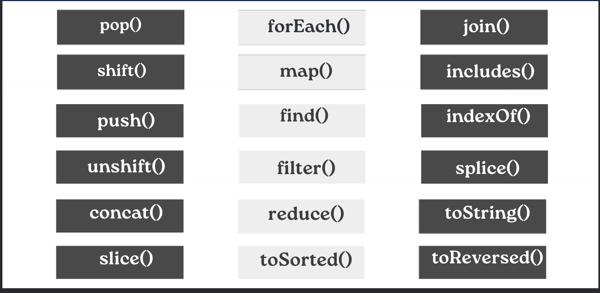

# What is array in Java Script?
## Sure! In JavaScript, an array is like a list that can hold multiple values. These values can be of any type: numbers, strings, objects, or even other arrays. Think of it as a container where you can store and organize multiple pieces of data under a single name. You can access these values using their position or index within the array. For example, if you have an array called `numbers`, you can access the first element with `numbers[0]`, the second with `numbers[1]`, and so on. Arrays are very useful for storing collections of related data.

#### ***(Конечно! На JavaScript массив - это как список, который может содержать несколько значений. Эти значения могут быть любого типа: числа, строки, объекты или даже другие массивы. Представьте себе его как контейнер, в котором вы можете хранить и организовывать несколько кусочков данных под одним именем. Вы можете получить доступ к этим значениям, используя их позицию или индекс внутри массива. Например, если у вас есть массив с именем `numbers`, вы можете получить доступ к первому элементу с помощью `numbers[0]`, ко второму - с помощью `numbers[1]` и так далее. Массивы очень полезны для хранения коллекций связанных данных.)***

___

# Array methods



___

# Array method `push`

## The `push()` method in an array is a simple way to add a new element to the end of the array. Imagine you have an array, and you want to add something new to it. You just say `"push"`, and then specify what you want to add. For example, if you have an array called `numbers`, and you want to add the number 5 to the end, you simply say `numbers.push(5)`. Now, the number 5 will be at the end of the array. It's like adding a new item to your shopping basket: you just put it on top.

#### ***(Метод `push()` в массиве - это простой способ добавить новый элемент в конец массива. Представьте, у вас есть массив, и вы хотите добавить в него что-то новое. Просто скажите `"push"`, а затем укажите, что вы хотите добавить. Например, если у вас есть массив с именем numbers, и вы хотите добавить число 5 в конец, вы просто скажете `numbers.push(5)`. Теперь число 5 будет в конце массива. Это как добавление нового предмета в вашу корзину покупок: вы просто кладете его сверху.)***

```
let numbers = [1, 2, 3, 4]; // Array with some numbers
console.log("Original Array:", numbers); // Output the original array

numbers.push(5); // Adding number 5 to the end
console.log("Array after push(5):", numbers); // Output the array after adding 5

```

___

## The `pop()` method in JavaScript is used to remove the last element from an array. It's like taking out the last item from a stack of plates. When you call `pop()` on an array, it removes the last element and returns it. If the array is empty, it returns `undefined`.

#### ***(Метод `pop()` в JavaScript используется для удаления последнего элемента из массива. Это похоже на то, как выбирать последнюю тарелку из стопки. Когда вы вызываете `pop()` для массива, он удаляет последний элемент и возвращает его. Если массив пуст, он вернет `undefined`.)***

```
let fruits = ["Apple", "Banana", "Orange"]; // Array with some fruits
console.log("Original Array:", fruits); // Output the original array

let lastFruit = fruits.pop(); // Removing the last fruit
console.log("Removed Fruit:", lastFruit); // Output the removed fruit
console.log("Array after pop():", fruits); // Output the array after pop()

```

___

## The `unshift()` method in JavaScript arrays is used to add one or more elements to the beginning of an array. It's like pushing items onto the front of a line. You specify the elements you want to add as arguments to `unshift()`. For example, if you have an array called fruits and you want to add the fruit `"apple"` to the beginning, you would use `fruits.unshift("apple")`.

#### ***(Метод `unshift()` в массивах JavaScript используется для добавления одного или нескольких элементов в начало массива. Это похоже на добавление элементов в начало очереди. Вы указываете элементы, которые хотите добавить, как аргументы для `unshift()`. Например, если у вас есть массив с именем `fruits`, и вы хотите добавить фрукт `"яблоко"` в начало, вы бы использовали `fruits.unshift("яблоко")`.)***

```
let fruits = ["banana", "orange", "grape"]; // Original array
console.log("Original Array:", fruits); // Output the original array

fruits.unshift("apple"); // Adding "apple" to the beginning
console.log("Array after unshift('apple'):", fruits); // Output the array after adding "apple"

```

___

## The `shift()` method removes the first element from an array and returns that removed element. It's like taking out the first item from a line. After `shift()` is executed, all remaining elements in the array are moved one position toward the start of the array.

#### ***(Метод `shift()` удаляет первый элемент из массива и возвращает этот удаленный элемент. Это как взять первый предмет из очереди. После выполнения `shift()` все оставшиеся элементы в массиве сдвигаются на одну позицию к началу массива)***

```
let fruits = ["Apple", "Banana", "Cherry", "Date"]; // Array with fruits
console.log("Original Array:", fruits); // Output the original array

let firstFruit = fruits.shift(); // Removing the first fruit
console.log("First fruit removed:", firstFruit); // Output the removed fruit
console.log("Array after shift():", fruits); // Output the array after shift

```

___

## The `toString()` method converts an array to a string of comma-separated values. It returns a string representing the elements of the array. Each element is converted to a string, and then concatenated together with a comma between each element. This method does not change the original array.

#### ***(Метод `toString()` преобразует массив в строку с элементами, разделенными запятыми. Он возвращает строку, представляющую элементы массива. Каждый элемент преобразуется в строку, а затем объединяется вместе с запятой между каждым элементом. Этот метод не изменяет исходный массив.)***

```
let fruits = ["Apple", "Banana", "Cherry", "Date"]; // Array with fruits
console.log("Original Array:", fruits); // Output the original array

let fruitsString = fruits.toString(); // Convert array to string
console.log("Array as string:", fruitsString); // Output the array as a string

```

___

## The `indexOf()` method returns the first index at which a given element can be found in the array, or -1 if it is not present. It searches the array for the specified item and returns its index if found, otherwise, it returns -1. This method searches the array from the beginning to the end.

#### ***(Метод `indexOf()` возвращает первый индекс, по которому данный элемент может быть найден в массиве, или -1, если он отсутствует. Он ищет указанный элемент в массиве и возвращает его индекс, если найден, в противном случае возвращает -1. Этот метод ищет элемент в массиве с начала до конца.)***

```
let fruits = ["Apple", "Banana", "Cherry", "Date"]; // Array with fruits
console.log("Original Array:", fruits); // Output the original array

let indexBanana = fruits.indexOf("Banana"); // Find index of "Banana"
let indexOrange = fruits.indexOf("Orange"); // Find index of "Orange"
console.log("Index of Banana:", indexBanana); // Output the index of "Banana"
console.log("Index of Orange:", indexOrange); // Output the index of "Orange"

```

___

## The `includes()` method checks whether an array includes a certain value among its elements. It returns true if the array contains the specified value, otherwise it returns false. This method searches the array from the beginning to the end.

#### ***(Метод `includes()` проверяет, содержит ли массив определенное значение среди своих элементов. Он возвращает true, если массив содержит указанное значение, в противном случае возвращает false. Этот метод ищет значение в массиве с начала до конца.)***

```
let fruits = ["Apple", "Banana", "Cherry", "Date"]; // Array with fruits
console.log("Original Array:", fruits); // Output the original array

let hasBanana = fruits.includes("Banana"); // Check if "Banana" is included
let hasOrange = fruits.includes("Orange"); // Check if "Orange" is included
console.log("Does it include Banana?", hasBanana); // Output the result for "Banana"
console.log("Does it include Orange?", hasOrange); // Output the result for "Orange"

```

___

## The `concat()` method is used to merge two or more arrays. It doesn't change the existing arrays; instead, it returns a new array that contains elements from all the arrays provided as arguments.

#### ***(Метод `concat()` используется для объединения двух или более массивов. Он не изменяет существующие массивы; вместо этого он возвращает новый массив, содержащий элементы из всех массивов, указанных в качестве аргументов.)***

```
let array1 = [1, 2, 3];
let array2 = [4, 5, 6];
let array3 = [7, 8, 9];

let newArray = array1.concat(array2, array3);

console.log("New Array:", newArray);

```

___

## The `slice()` method extracts a section of an array and returns a new array containing the extracted elements. It takes two parameters: the starting index (inclusive) and the ending index (exclusive) of the section to be extracted. If no end index is provided, slice() extracts to the end of the array.

#### ***(Метод `slice()` извлекает секцию массива и возвращает новый массив, содержащий извлеченные элементы. Он принимает два параметра: начальный индекс (включительно) и конечный индекс (исключительно) секции для извлечения. Если конечный индекс не указан, slice() извлекает элементы до конца массива.)***

```
let numbers = [1, 2, 3, 4, 5];

// Extracting a section from index 1 to index 3 (exclusive)
let section = numbers.slice(1, 3);

console.log("Original Array:", numbers);
console.log("Extracted Section:", section);

```

___

## The `splice()` method changes the contents of an array by removing or replacing existing elements and/or adding new elements in place. It can take multiple parameters:

## 1. The starting index (required): The index at which to start changing the array.

## 2. The number of elements to remove (optional): An integer indicating the number of elements to remove.

## 3. The elements to add (optional): Any number of elements to add to the array, beginning at the start index.

## The `splice()` method returns an array containing the deleted elements, or an empty array if no elements are deleted.

#### ***(Метод `splice()` изменяет содержимое массива, удаляя или заменяя существующие элементы и/или добавляя новые элементы на их место. Он может принимать несколько параметров:***

 #### ***1. Начальный индекс (обязательный): Индекс, с которого начинается  изменение массива.***
   
  ***2. Количество удаляемых элементов (необязательно): Целое число, указывающее количество удаляемых элементов.***

   ***3. Элементы для добавления (необязательно): Любое количество элементов для добавления в массив, начиная с начального индекса.***

#### ***Метод `splice()` возвращает массив, содержащий удаленные элементы, или пустой массив, если элементы не были удалены.)***

```
let fruits = ["Apple", "Banana", "Cherry", "Date"];

// Удаление "Banana" с индекса 1
let removedItems = fruits.splice(1, 1);

console.log("Фрукты после splice:", fruits); // Вывод массива после splice
console.log("Удаленные элементы:", removedItems); // Вывод удаленного элемента

```

___

## The `join()` method creates and returns a new string by concatenating all the elements in an array, separated by a specified separator string. If no separator is provided, the default separator is a comma ,.

#### ***(Метод `join()` создает и возвращает новую строку, объединяя все элементы массива, разделенные указанной строкой-разделителем. Если разделитель не указан, используется запятая , в качестве разделителя по умолчанию.)***

```
let fruits = ["Apple", "Banana", "Cherry", "Date"];

// Joining array elements with a hyphen as separator
let result = fruits.join("-");

console.log("Joined String:", result);

```

___

# Java Script array methods callback

## The `map()` method creates a new array by applying a function to each element in the original array. It calls the provided function once for each element in the array in order and constructs a new array from the results. The original array remains unchanged.

#### ***(Метод `map()` создает новый массив, применяя функцию к каждому элементу исходного массива. Он вызывает предоставленную функцию один раз для каждого элемента массива в порядке и создает новый массив из результатов. Исходный массив остается неизменным.)***

```
let numbers = [1, 2, 3, 4, 5];

// Doubling each number in the array using arrow function
let doubledNumbers = numbers.map(num => num * 2);

console.log("Original Array:", numbers);
console.log("Doubled Numbers:", doubledNumbers);

```

___

## The `forEach()` method executes a provided function once for each array element. It iterates over the array elements in ascending order and does not return a new array. The primary purpose of `forEach()` is to perform a side effect for each array element.

#### ***(Метод `forEach()` выполняет предоставленную функцию один раз для каждого элемента массива. Он перебирает элементы массива в порядке возрастания и не возвращает новый массив. Основная цель `forEach()` - выполнить побочный эффект для каждого элемента массива.)***

```
let numbers = [1, 2, 3, 4, 5];

// Logging each element of the array using forEach and arrow function
numbers.forEach(num => console.log(num));

```

___

##  Let's say we have an array of names, and we want to print a greeting message for each name in the array using the `forEach()` method. 

```
let names = ["Alice", "Bob", "Charlie", "David"];

// Greeting each person in the array using forEach
names.forEach(name => {
    console.log("Hello, " + name + "!");
});

```
#                    ↓ ↓ ↓  **`RESULT`** ↓ ↓ ↓  
```
Hello, Alice!
Hello, Bob!
Hello, Charlie!
Hello, David!

```

___

## The `filter()` method creates a new array with all elements that pass the test implemented by the provided function. It iterates over each element in the array and executes the provided function once for each element. If the function returns true for an element, that element is included in the new array; otherwise, it is excluded.

#### ***(Метод `filter()` создает новый массив со всеми элементами, прошедшими проверку, реализованную предоставленной функцией. Он перебирает каждый элемент в массиве и выполняет предоставленную функцию один раз для каждого элемента. Если функция возвращает true для элемента, этот элемент включается в новый массив; в противном случае он исключается.)***

```
let numbers = [1, 2, 3, 4, 5];

// Filtering even numbers from the array using filter and arrow function
let evenNumbers = numbers.filter(num => num % 2 === 0);

console.log("Original Array:", numbers);
console.log("Even Numbers:", evenNumbers);

```

___